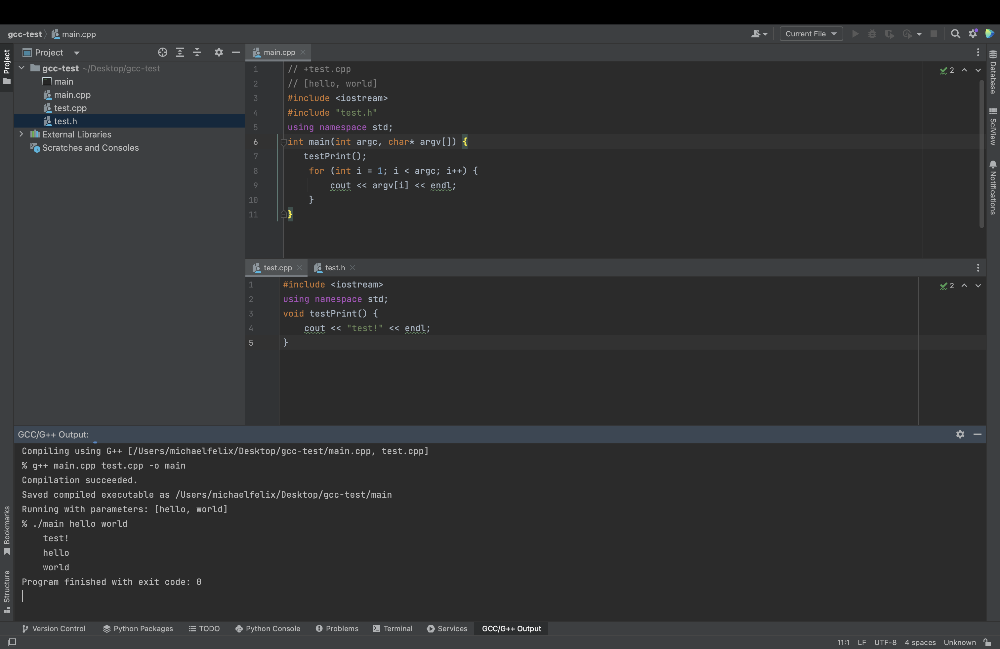
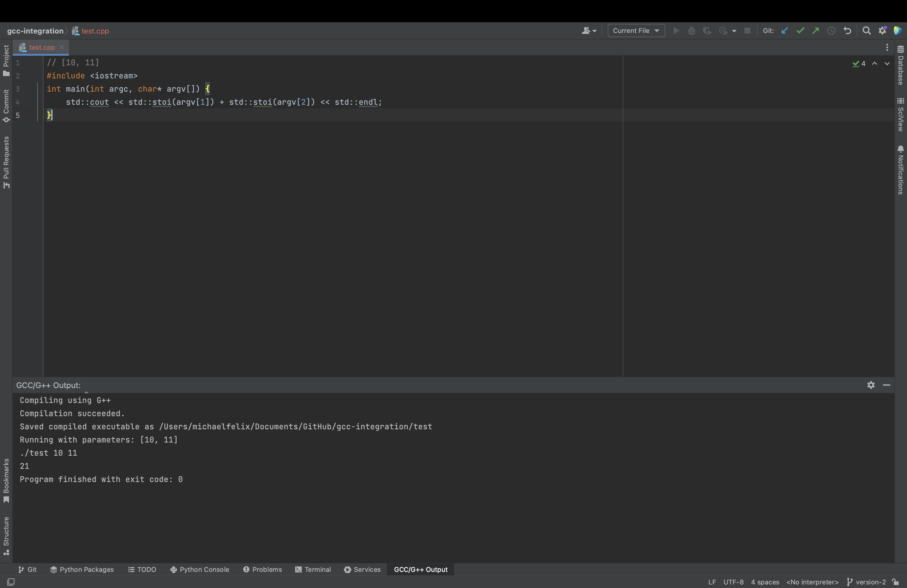

# Plugin Configuration

Adding inline comments to the active C/C++ file above all code can modify the behavior of compilation/running of the active file's code.

In this example we've added `test.cpp` as an additional source file for the plugin when it compiles `main.cpp`. We've also chosen the parameters of "hello" & "world" for the `main.cpp` file. The plugin determines which file is the "active file" based on which one you've clicked onto last.

As `main.cpp` is the active file while we press `alt + G` in this example, the plugin compiles it along with the specified additional source file `test.cpp`, and then runs the resulting executable with the specified params (hello, world).

For more information on configuring these types of settings, read on!

----

#### Settings Syntax:
- [Adding Arguments/Parameters](#adding-argumentsparameters)
    - `// [param1, param2, ...]` 
- [Adding Additional Source Files](#adding-additional-source-files)
    - `// +file1.c, +file2.c, +../file3.c, ...`

### Adding Arguments/Parameters

By default, no parameters will be passed to the active file when it's run after compilation. To add parameters, add a comment above all code in the active file listing all desired parameters:

    // [param1, param2, param3, ...]
    #include <stdio.h>
    int main() {};

This supports adding files, integers, or anything else as parameters. For file paths in parameters, you can either use an absolute path, or a relative path from the active file's directory.

### Adding Additional Source Files

Adding comments above the code that begin with `+file.c` will tell the plugin to compile the current file along with the ones specified.

You can use the syntax:

    // +file.cpp
    // +file2.cpp

or list multiple files in one line like:

    // +file.cpp, file2.cpp